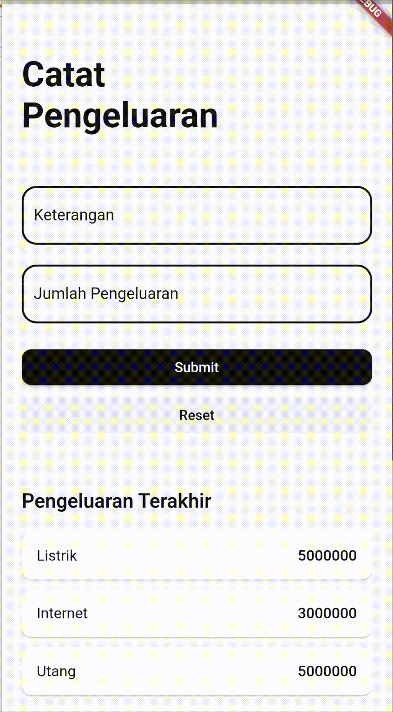

# Table Of Content
- [Table Of Content](#table-of-content)
- [Pengenalan](#pengenalan)
  - [Dart](#dart)
  - [Flutter](#flutter)
  - [Instalasi](#instalasi)
  - [IDE](#ide)
- [DART](#dart-1)
  - [Asinkronus Pada Dart](#asinkronus-pada-dart)
- [Lab 1 (Create Flutter Projek)](#lab-1-create-flutter-projek)
  - [Membuat Projek Flutter](#membuat-projek-flutter)
  - [Main File](#main-file)
  - [Common Widget](#common-widget)
    - [Material App](#material-app)
    - [Scaffold](#scaffold)
- [Lab 2 (Widget)](#lab-2-widget)
  - [Container](#container)
  - [Column](#column)
  - [Row](#row)
  - [Expanded](#expanded)
  - [Praktek](#praktek)
- [Lab 3 (Widget Part 2)](#lab-3-widget-part-2)
  - [ListView](#listview)
  - [Text](#text)
  - [TextField](#textfield)
  - [ElevatedButton](#elevatedbutton)
  - [Card](#card)
  - [Praktek](#praktek-1)
- [Lab 4 (Stateless and Statefull Widget)](#lab-4-stateless-and-statefull-widget)
  - [Praktek](#praktek-2)
    - [Interaksi](#interaksi)
    - [Code Splitting](#code-splitting)
- [Lab 5 (Navigation)](#lab-5-navigation)
  - [Menggunakan Navigator](#menggunakan-navigator)
# Pengenalan
## Dart
Merupakan bahasa pemrograman asynchronous berbasis OOP yang dapat digunakan untuk membuat aplikasi di segala platform

## Flutter
Sebuah framework yang digunakan pada bahasa pemrograman dart untuk membuat tampilan atau ui.

## Instalasi
Instalasi Flutter dapat dimulai dengan menginstall Android Studio seperti biasa lalu kemudian bisa ikuti langkah langkah instalasi pada dokumentasi instalasi flutter sebagai berikut [Dokumentasi Instalasi Flutter](https://docs.flutter.dev/get-started/install)

## IDE
Untuk IDE yang digunakan bisa menggunakan android studio langsung atau menggunakan IDE lain seperti Visual Studio Code. Dengan alasan tertentu penulis lebih suka menggunakan Visual Studio Code sehingga penulis menggunakan Visual Studio Code dengan menginstall ekstensi flutter pada Visual Studio Code

# DART
Pada dasarnya syntax dan fitur pada dart tidak jauh berbeda dengan bahasa pemrograman lain. jadi jika sudah pernah menggunakan bahasa OOP lain hanya perlu penyesuaian sedikit bahkan bahasa dart ini terbilang cukup lebih mudah
## Asinkronus Pada Dart
Dart mendukung proses asinkronus dimana dart dapat mengeksekusi tugas-tugas secara non-bloking (Mirip Seperti Javascript).

Pada kebanyakan bahasa pemrograman (PHP, Java, Golang, Python), menggunakan konsep blocking dimana jika ada Task 1 dan Task 2, Task 2 akan dijalankan setelah Task 1 benar-benar selesai di proses.

Sedangkan pada bahasa Asinkronus jika ada Task 1 dan Task 2, Task 2 akan dijalankan setelah Task 1 sudah dieksekusi (Tanpa perlu proses nya selesai, yang penting di eksekusi)

# Lab 1 (Create Flutter Projek)
## Membuat Projek Flutter
Untuk menginisiasi projek flutter dapat menggunakan perintah berikut

```bash
flutter create lab1
```

Perintah tersebut akan membuat directory dengan nama lab1 dimana direktori tersebut adalah projek flutter kita

Inisiasi proyek juga dapat dilakukan menggunakan GUI Visual Studio Code seperti berikut


## Main File
Flutter memiliki satu main file, dimana file tersebut yang akan dieksekusi saat aplikasi flutter dijalankan file tersebut terletak di `lib/main.dart`

## Common Widget
Semua yang ada pada UI Flutter merupakan sebuah Widget yang saling berkaitan, bahkan saat kita membuat sebuah halaman atau tampilan itu juga akan menjadi widget

### Material App
Widget yang digunakan sebagai titik awal dalam membangun aplikasi dengan desain Material. `MaterialApp` menyiapkan banyak konfigurasi dasar dan menyediakan struktur dasar yang diperlukan untuk mengembangkan aplikasi Flutter dengan tampilan Material Design.

### Scaffold
Dalam Flutter, Scaffold adalah widget yang digunakan sebagai kerangka dasar untuk membangun antarmuka aplikasi. Scaffold menyediakan struktur umum yang umumnya ditemukan dalam aplikasi, seperti AppBar, body, drawer, dan sebagainya

# Lab 2 (Widget)
Dalam Flutter memiliki beberapa widget untuk keperluan layouting sebagai berikut
## Container
Container Merupakan sebuah widget yang berfungsi sebagai wadah dari widget utama yang ingin ditampilkan (Button, Text, dll). Dikatakan sebuah wadah karena widget sering digunakan untuk mengatur padding, margin, background untuk widget dibawahnya berikut contoh untuk pemanggilan widget Container, dimana terlihat Widget Container sebagai widget parent dan child nya adalah widget Text
```dart
Container(
    color: Colors.red,
    padding: EdgeInsets.all(20),
    child: Text("Text Container 1"),
)
```

## Column
Column merupakan sebuah widget yang berfungsi juga sebagai wadah, bedanya dengan Container widget ini dapat memiliki lebih dari 1 Child yang nanti nya akan di render secara vertikal
```dart
Column(
    children: [
        Container(child: Text("Text1")),
        Container(child: Text("Text2"))
    ] 
)
```
## Row
Row merupakan sebuah widget yang berfungsi juga sebagai wadah dan memiliki lebih dari 1 child bedanya dengan column widget didalam sini akan dirender secara horizontal
```dart
Row(
    children: [
        Container(child: Text("Text1")),
        Container(child: Text("Text2"))
    ]
)
```

## Expanded
Sebuah widget wadah dimana widget ini akan menggunakan semua ruang tersisa pada widget parent nya
```dart
Row(
    children: [
        Container(child: 
            Text("Text1")
        ),
        Expanded(
            child: Container(
                child: Text("Text2")
            )
        )
    ]
)
```
## Praktek
Pada projek `lab2` anda bisa melihat contoh penggunaan dan perpaduan widget diatas dengan beberapa tambahan widget lain

# Lab 3 (Widget Part 2)
Pada bagian ini akan menunjukan beberapa contoh widget lain yang umum digunakan dan salah cara merender widget dengan menggunakan konsep looping

## ListView
Pada dasarnya ukuran halaman pada UI flutter akan mengikuti panjang dan lebar device nya, sehingga jika kita ingin membuat tampilan list yang sangat panjang kita memerlukan widget ini untuk dapat memanggunakan ukuran list yang panjang atau lebarnya melebihi ukuran device dan akan ditampilkan dalam bentuk scrolling
```dart
ListView(
    children: [
        Text("1"),
        Text("2"),
        Text("3"),
        Text("4"),
        Text("5"),
    ]
)
```

## Text
Widget untuk menampilkan sebuah text
```dart
const Text(
    "Catat\nPengeluaran",
    style: TextStyle(
        color: Color(0xFF141414),
        fontWeight: FontWeight.w700,
        fontSize: 35,
    ),
),
```

## TextField
Widget untuk membuat sebuah inputan text
```dart
TextField(
    cursorColor: Color(0xFF141414),
    decoration: InputDecoration(
        focusedBorder: OutlineInputBorder(
            borderRadius: BorderRadius.all(
                Radius.circular(15),
            ),
            borderSide: BorderSide(
                color: Color(0xFF141414),
                width: 2.0,
            ),
        ),
        enabledBorder: OutlineInputBorder(
            borderRadius: BorderRadius.all(
                Radius.circular(15),
            ),
            borderSide: BorderSide(
                color: Color(0xFF141414),
                width: 2.0,
            ),
        ),
        labelText: 'Jumlah Pengeluaran',
        labelStyle: TextStyle(
            color: Color(0xFF141414),
        ),
    ),
)
```

## ElevatedButton
Widget untuk membuat sebuah button yang nantinya bisa menerima trigger `tap`
```dart
ElevatedButton(
    style: ElevatedButton.styleFrom(
        backgroundColor: const Color(0xFF141414),
        shape: RoundedRectangleBorder(
            borderRadius:
            BorderRadius.circular(10.0),
        ),
    ),
    onPressed: () {},
    child: const Text('Submit'),
)
```

## Card
```dart
Card(
    child: Text("tes")
)
```

## Praktek
Untuk praktek pada lab 3 akan membuat sebuah tampilan seperti berikut (Sudah disediakan template pada folder lab3 dan hasilnya ada di lab3_final)

<div style="display: flex;">
  
  
  
</div>

# Lab 4 (Stateless and Statefull Widget)
Pada dasar nya Widget pada flutter ada 2 jenis, Stateless dan Statefull widget, sesuai namanya perbedaan keduanya ada pada ada atau tidak nya state/keadaan pada widget tersebut.

Stateless Widget adalah widget yang state/keadaan nya selalu tetap dan tidak berubah-ubah semenjak di inisiasi, jenis widget ini biasa digunakan untuk widget-widget kecil yang dibuat untuk di panggil di tempat lain sebagai reusable widget/component, contohnya jika kita membuat custom form yang akan kita gunakan berkali-kali di berbagai tempat kita akan menggunakan stateless widget untuk membuat widget/komponen tersebut.

Statefull Widget adalah widget yang state/keadaan nya dapat berubah ubah semenjak di inisiasi, jenis widget ini biasa digunakan untuk membuat halaman yang memiliki interaksi yang merubah state/keadaan halaman tersebut. contohnya jika kita membuat halaman kalkulator tentunya akan ada interaksi di halaman tersebut yang merubah keaadaan pada halaman tersebut

## Praktek
Praktek disini akan terdiri dari beberapa tahap

### Interaksi
Pada praktek ini akan menggunakan projek `lab4` sebagai template dan hasil dari praktek ini sudah ada di projek `lab4_interaksi`. Goal dari praktik ini adalah menerima inputan user dan menambahkan nya ke list yang sudah ada. Berikut hasilnya




### Code Splitting
Pada praktek ini akan menggunakan projek `lab4_interaksi` sebgai template dan hasil dari praktek ini sudah ada di projek `lab4_final`. Goal dari praktik ini adalah membagi bagi code yang panjang menjadi beberapa bagian dan memanggilanya


# Lab 5 (Navigation)
Pada lab ini akan mempelajari bagaimana melakukan navigasi pada flutter, pada folder lab5 sudah disiapkan projek yang sudah disiapkan 5 screen sebagai berikut tetapi belum ada navigasi antar screen tersebut
<div style="display: flex;flex-wrap: wrap;">
  
  
  
  
  
</div>

Pada umumnya pada Flutter memiliki 3 cara navigasi yaitu
1. Menggunakan Navigator
2. Menggunakan Named Routes
3. Menggunakan Third Party Libraries yang berfungsi sebagai route management (Bisanya jika butuh fitur lebih)

## Menggunakan Navigator
berikut contoh untuk berpindah ke halaman `LoginPage` menggunakan Navigator, anda bisa menggunakan script dibawah pada trigger `onTap` atau lainya
```dart
Navigator.of(context).push(
    MaterialPageRoute(
      builder: (context) => const LoginPage(),
    ),
);
```
Jika kamu ingin membawa sebuah data ke `screen selanjutnya` anda bisa mengkonfigurasi Screen tujuan untuk menerima parameter seperti berikut
```dart
class ExpenseDetailPage extends StatelessWidget {
  final String amount;
  final String description;
  const ExpenseDetailPage({
    super.key,
    required this.amount,
    required this.description,
  });

  @override
  Widget build(BuildContext context) {
    return Scaffold(
      backgroundColor: Colors.white,
      body: Row(
        children: [Text(amount), Text(description)]
      )
    );
  }
}
```
diatas adalah contoh jika `screen selanjutnya` merupakan stateless widget,berikut jika `screen selanjutnya` merupakan statefull widget
```dart
import 'package:flutter/material.dart';

class ExpenseDetailPage extends StatefulWidget {
  final String amount;
  final String description;
  const ExpenseDetailPage({
    super.key,
    required this.amount,
    required this.description,
  });

  @override
  State<ExpenseDetailPage> createState() => _ExpenseDetailPageState();
}

class _ExpenseDetailPageState extends State<ExpenseDetailPage> {
  @override
  Widget build(BuildContext context) {
    return Scaffold(
      backgroundColor: Colors.white,
      body: Row(children: [Text(widget.amount), Text(widget.description)])
    );
  }
}
```

Lalu anda  bisa berpindah halaman dengan kode berikut
```dart
Navigator.of(context).push(
    MaterialPageRoute(
      builder: (context) => const ExpenseDetailPage(amount: "5000", description: "Lorem Ipsum Dolor Sit Amet"),
    ),
);
```